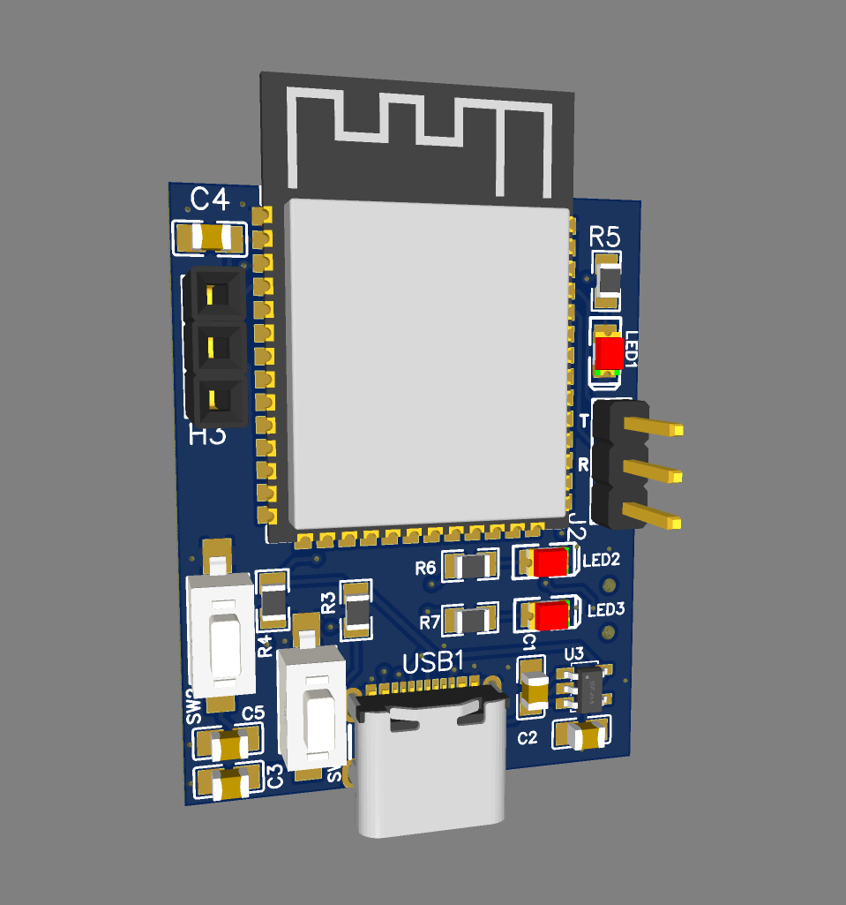
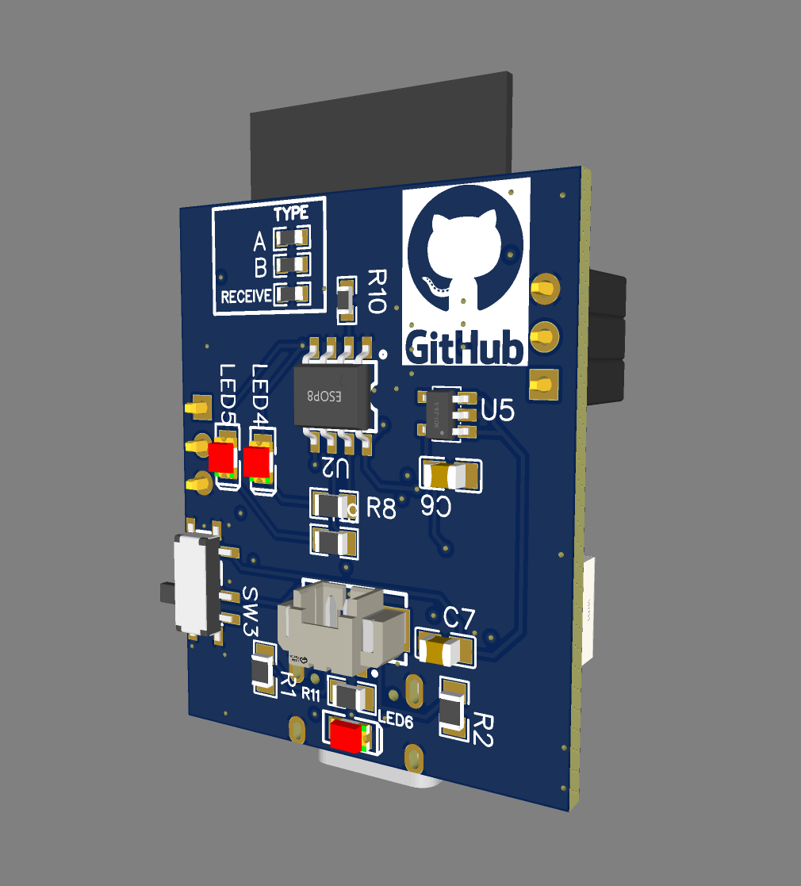

# ESP32门铃
其实根本不是不是门铃

ESP-NOW🛜

低功耗🔋

复刻简单👌

基于ESP32-S3📶

## 它可以干什么？
可以贴在宿舍门口的左右两侧，一旦有人经过可以发出无线消息，来实现提防宿管偷袭的效果。
## 原理
利用ESPNOW把红外传感器的数据发送给接收器，使得消息可以在无需WiFi的情况下直接发送，既发挥了ESP32的性能，又降低了成本，不需要专门用一颗射频芯片发射信号，也不会被ADMIN在WiFi列表里发现异样的信号（那够尴尬的）
ESPNOW只需要知道接收端的MAC的地址即可完成消息发送，延迟也相对其他的通信方式如Lora更低。
## 复刻困难吗？
在设计上十分简单，复刻过程中不存在有难度的问题
### V0.1
已上传原理图和LAYOUT文件

