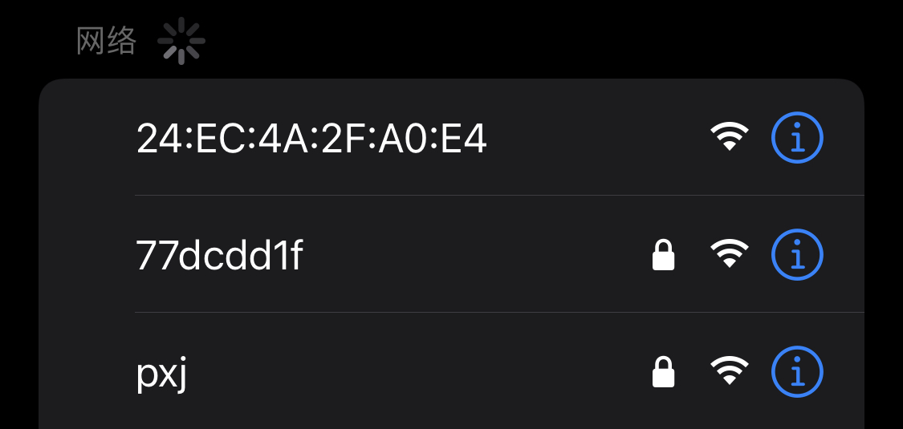

# ESP32门铃
其实根本不是不是门铃

ESP-NOW🛜

低功耗🔋

复刻简单👌

基于ESP32-S3📶

## 它可以干什么？
可以贴在宿舍门口的左右两侧，一旦有人经过可以发出无线消息，来实现提防宿管偷袭的效果。
## 原理
利用ESPNOW把红外传感器的数据发送给接收器，使得消息可以在无需WiFi的情况下直接发送，既发挥了ESP32的性能，又降低了成本，不需要专门用一颗射频芯片发射信号，也不会被ADMIN在WiFi列表里发现异样的信号（那够尴尬的）
ESPNOW只需要知道接收端的MAC的地址即可完成消息发送，延迟也相对其他的通信方式如Lora更低。
## 复刻困难吗？
在设计上十分简单，复刻过程中不存在有难度的问题
## 结构
由3个ESP32S3节点组成，双发单收

由发射机A,B与接收机构成

3块板子是同样的PCB，这样可以降低成本一次打样完成PCB的制作。
### V0.1
已上传原理图和LAYOUT文件

| GPIO    |   功能  |
| ------- | ------- |
|   IO4   | 传感器   |
|  IO5    |  LED1   |
|   IO6   |  LED2   |
|  IO7    |  LED3   |

左侧母口为人体红外传感器接口从上到下为GND,3V3,IO4

右侧UART串口从上到下依次是ESP32的TX,RX,GND（在使用串口转接模块时记得TX,RX是交叉连接的）

TYPE处的电阻仅用于标识，没有其他作用

3D效果图

可以使用以下人体红外模块，在某宝可以找到，价格大概在6块包邮

# 部署
## MAC的获取
通过编译MAC文件夹中的文件，ESP32将会开启一个热点，其热点的名字（SSID）就是此ESP32的MAC地址

效果如图

获取MAC的程序仅仅需要烧录到接收机上即可，因为只有接收端才需要知道MAC地址

在v0.1中请使用MAC_N8R8中的固件来获取板子的MAC信息，其他固件有可能导致ESP32S3崩溃

请不要给只有4MB Flash的ESP32S3模组烧录此固件，否则会因分区表与实际不符问题反复报错无法运行

❗请记好接收机的地址

❗按着BOOT键同时插上USB线，插上后再松手使得ESP32S3进入烧录模式

❗注意，v0.1中的所有开发板版本均以ESP32-S3 N8R8（有8MB Flash 和 8MB PSRAM）为准，在复刻v0.1版本时不要买错其他模块了。

